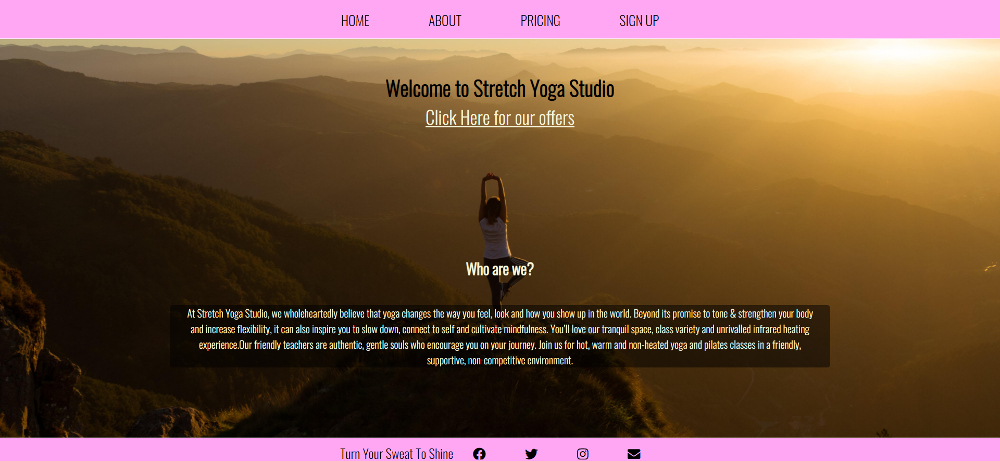

# Stretch Yoga Studio is a site for a new up and coming chic and urban yoga studio located in X. The sites aim primarily is to give more information about Best Yoga studio with hours of operation, history, testimonials, two different pricing options and a contact form.

# Features

## Existing Features

### Navigation Bar

<li>Featured on all four pages, the full responsive navigation bar as I had used and activated the flex to make my work a bit easier for me includes links to the Home page, Abour, Pricing and Sign Up/contact page and is identical in each page to allow for easy navigation. It has a hover effect of changing colors and adding un underline as well as scaling up to add a modern effect to it.</li>

### The landing page

<li>The landing includes a photograph of a young lady doing a yoga pose with text overlay to inspire the user to sign up easily.</li>

<li>This page has a link you can click to take you to the sign up page as well as a paragraph about the studio's ethos</li>

<li>Main section on home page includes the name of the business and a link that takes you to a sign up page and it is for a promotion studio is doing.
Link has a hover effect of scaling up for a modern effect.</li>

### About Page

<li>This section includes a video about history of Stretch yoga studio as well as a section with testimonials, hours of operation and a google map of the place</li>

<li>User has to press play on the link to play the video and turn up the volume manually</li>

<li>This page also includes two images of people doing yoga</li>

### Pricing Page 

<li>This section includes a picture of the inside of the studio with two different payment options which will change from time to time</li>

<li>The payment option windows have price listed with SIGN UP NOW a tag which on hover scales up and changes color and when clicked takes you to the next page which is Sign up</li>

### Sign up page

<li>This page has a beautiful background of the studios users doing the yoga out on the beach</li>

<li>Page features a sign up form which has no labels but rather I decided to use placeholders for the clean look. It also has two radio buttons for two different plans</li>

<li>Submit button has a hover effect where text changes color and scales up for modern effect</li>

### Footer 

<li>The footer section includes links to the relevant social media sites for Love Running. The links will open to a new tab to allow easy navigation for the user.</li>

<li>The footer is identical on all four different pages of BYS site. The links will open to a new tab to allow easy navigation for the user.
The footer is valuable to the user as it encourages them to keep connected via social media.</li>

## Testing

<ul>Validator Testing</ul>

<li> HTML test with https://validator.w3.org/ No errors were returned when passing through the official W3C validator</li>

<li>CSS https://validator.w3.org/ No errors were found when passing through the official (Jigsaw) validator</li>

## Unfixed Bugs

### Working with only HTML and CSS responsiveness is not perfect as it would require many media queries. I have only used three breakpoints

## The site was deployed to GitHub pages. The steps to deploy are as follows:
### In the GitHub repository, navigate to the Settings tab
### From the source section drop-down menu, select the Master Branch

### Once the master branch has been selected, the page will be automatically refreshed with a detailed ribbon display to indicate the successful deployment.
### The live link can be found here - https://ivanlasic23.github.io/Project1/about.html

## Credits

### Media:

[Home page pic](https://unsplash.com/photos/I2YSmEUAgDY)
[About page pic](https://unsplash.com/photos/rX8gBeg2WM0)
[Pricing page pic](https://unsplash.com/photos/3jztLhBPrUo)
[Sign Up page pic](https://unsplash.com/photos/GaprWyIw66o)
[Video link](https://www.youtube.com/watch?v=qnxzm6gngXA)

## Content:
<li>The content used is all done by me</li>
